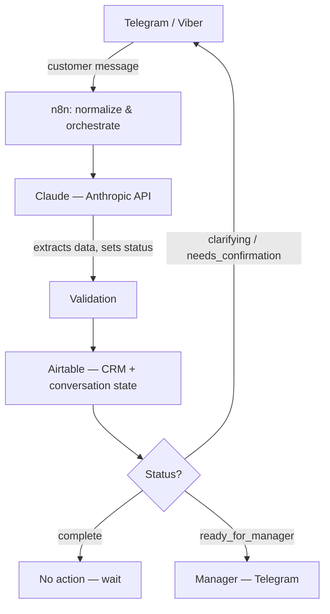

# Travel Request Automation — Telegram/Viber → Claude → Airtable → Manager Handoff

An n8n workflow that automates the intake and qualification of travel booking requests. Customers write in via Telegram or Viber; an AI agent (Claude) extracts structured trip data, asks clarifying questions until the request is complete, and hands off a ready-to-book lead to a human manager.

## Overview

A travel agency receives requests like:

> "Хочу в Турцию на 7 ночей в сентябре, 2 взрослых, бюджет €2000"

This workflow turns that free-text message into a structured, validated lead — without a human touching it until it's actually ready to be booked.

**Design principle:** first ship a solid lead-qualification pipeline (no auto-booking), but keep the architecture modular so a travel API / automated booking step can be added later without touching the existing modules.

## Architecture



| Layer | Responsibility |
|---|---|
| **Telegram / Viber** | Customer communication channel |
| **n8n** | Orchestration, routing, business logic |
| **Claude (Anthropic API)** | Natural language understanding, data extraction, status decision |
| **Airtable** | CRM + conversation/lead state |
| **Telegram (manager chat)** | Human handoff notification |

## Tech Stack

- **n8n** — workflow orchestration
- **Claude (Anthropic API)** — structured data extraction & conversational clarification
- **Airtable** — CRM / lead & conversation state store
- **Telegram Bot API** — primary customer channel + manager notifications
- **Viber REST API** — secondary customer channel (via generic Webhook/HTTP nodes, no native n8n integration)

## How It Works — Node by Node

| # | Node | Purpose |
|---|---|---|
| 1 | `Telegram: новое сообщение` | Trigger — listens for incoming Telegram messages |
| 2 | `Viber: новое сообщение` | Trigger — generic webhook for incoming Viber messages |
| 3 | `Нормализация (Telegram)` | Maps Telegram payload to a unified schema |
| 4 | `Нормализация (Viber)` | Maps Viber payload to the same unified schema |
| 5 | `Airtable: получить лид` | Looks up existing lead/conversation by `chat_id` |
| 6 | `Подготовка контекста для Claude` | Merges conversation history + new message for the AI call |
| 7 | `Claude: анализ и статус` | Calls Claude; extracts trip data and determines status |
| 8 | `Разбор ответа Claude` | Parses Claude's JSON response |
| 9 | `Валидация данных` | Hard validation (budget > 0, valid month range, etc.); forces status back to `clarifying` on failure |
| 10 | `Airtable: сохранить/обновить лид` | Upserts the lead by `chat_id` — prevents duplicates |
| 11 | `Switch: статус лида` | Routes by status: `ask_client`, `ready_for_manager`, `complete` |
| 12 | `If: канал = Telegram` | Routes the reply back through the customer's original channel |
| 13 | `Telegram: уточняющий вопрос` | Sends Claude's next question / confirmation summary (Telegram) |
| 14 | `Viber: уточняющий вопрос` | Same, via direct Viber API call (HTTP Request) |
| 15 | `Telegram: уведомить менеджера` | Notifies the manager with a lead summary when status is `ready_for_manager` |
| 16 | `Нет действия (данные собраны)` | No-op — data is complete but purchase intent not yet confirmed; workflow waits |

## Status Flow

```
clarifying          → required fields missing, ask next question
needs_confirmation  → all fields collected, reflect them back for customer confirmation
                       (catches plausible-but-wrong values, e.g. "August" typed instead of "September")
complete             → customer confirmed the data, but hasn't signaled readiness to book yet
ready_for_manager    → customer confirmed AND is ready to book/pay → handed off to manager
```

## Data Schema (Airtable — `Leads` table)

| Field | Type | Description |
|---|---|---|
| `chat_id` | text | Unique per customer/channel — used for upsert |
| `channel` | single select | `telegram` \| `viber` |
| `structured_data` | long text (JSON) | destination, dates, nights, adults, children, budget, budget_type, meal_plan, region, hotel_category |
| `status` | single select | `clarifying` \| `needs_confirmation` \| `complete` \| `ready_for_manager` |
| `conversation_history` | long text (JSON) | Full message history for context continuity |
| `last_updated` | date/time | Auto-set on every upsert |

## Setup

1. Import `reise_workflow.json` into n8n (`... → Import from File`)
2. Create credentials:
   - Telegram Bot API token (customer bot)
   - Airtable Personal Access Token
   - Anthropic API key
   - Viber Auth Token (used as a custom header, not a native n8n credential type)
3. Replace placeholders in the workflow:
   - `YOUR_BASE_ID` → your Airtable Base ID (both Airtable nodes)
   - `MANAGER_CHAT_ID` → the manager's Telegram chat ID
4. Create the Airtable `Leads` table with the fields listed above
5. Register the Viber webhook: `POST https://chatapi.viber.com/pa/set_webhook` pointing to your n8n webhook URL

## Roadmap

- [ ] Automated booking via travel API (plug into the `ready_for_manager` branch)
- [ ] WhatsApp as an additional channel
- [ ] Structured field validation via JSON schema instead of hand-written checks
- [ ] Analytics dashboard on lead conversion (clarifying → ready_for_manager rate)

## Author

Built by Helena as part of her AI-automation / process-optimization portfolio.
